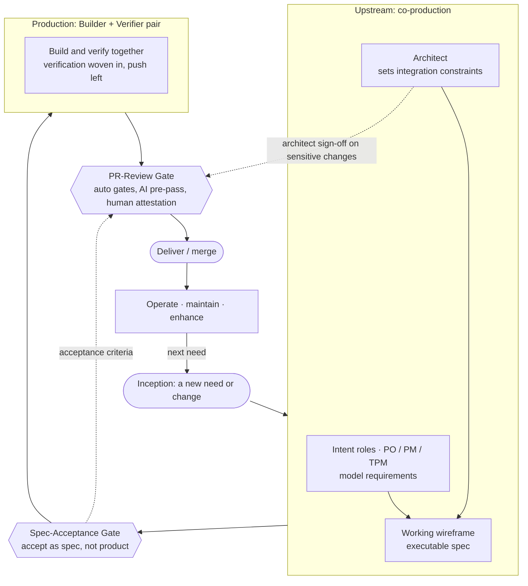

# §1. Roles

**Status:** Draft v0.1
**Canonical ID:** §1 (stable; numbers are never reused or reordered)

**Principle.** Roles organize around the three new constraints (specification,
verification, integration), not around layers of the stack. Titles that
described *which part of the code you wrote* (frontend, backend) collapse,
because generation got cheap. Roles that *reduce ambiguity, establish trust, or
hold the whole system coherent* gain leverage, because those are the new
constraints. Read every role below as "which constraint do you sit on."

The sub-sections run in lifecycle order, from inception toward delivery: intent,
then architect, then the builder + verifier production unit. Verification is not a
final stage; it is woven in (see §1c and §3). The architect spans the whole loop
rather than occupying one step (see §1d).

> **Citation note.** The stable citation unit is the principle number (§1). The
> sub-part letters (1a, 1b, ...) describe position and may be reorganized; cite
> the principle number when you want a durable reference.

## 1a. The intent roles: PO / PM / TPM

**Principle.** Product Owner, PM, and TPM now sit directly on the
**specification** constraint, which is a primary one. Their generative tools
(wireframes, working prototypes, modeled requirements) let them produce
*executable specifications*. This is a real increase in their leverage: a running
prototype removes intent ambiguity that prose requirements never could, and it
kills the translation loss that used to occur at the handoff to engineering.

**Principle (the fidelity trap).** The new failure mode this introduces is that a
prototype now *runs*, which removes the signal that used to tell everyone it
wasn't done. There are two orthogonal axes of fidelity:

- **Intent fidelity.** Does this capture what we want built? Prototypes are now
  superb at this.
- **Production fidelity.** Is it safe to own and operate at scale (security,
  error handling, edge cases, observability, data integrity, maintainability,
  compliance)? Prototypes are near zero at this.

Functional behavior makes these axes *look* correlated when they are orthogonal.
A running happy path looks complete. The trap is the category error: mistaking a
high-intent-fidelity artifact for a high-production-fidelity one, and shipping
technical debt as if it were product.

**Principle (the working wireframe).** Name the artifact. What the intent roles
produce is a **working wireframe**: an executable specification whose job is to
give the builder + verifier unambiguous direction. It is the highest-fidelity
spec format we have ever had and the clearest instance of §5's durable spec. File
it under *spec*, not under *code*.

- **Definition of done** for a working wireframe: stakeholders agree it captures
  intent. NOT "it runs."
- **Explicit non-goal:** it is never a production candidate. The builder +
  verifier rebuild it to production fidelity (cheap, per §5; the prototype itself
  may be discarded, and that is fine).
- **Required gate:** a named acceptance step where the prototype is accepted *as
  a spec*, after which production is built from it. Make "rebuild from the spec"
  cheap (agents make it so) and make "ship the prototype" procedurally hard. The
  pull to ship a thing that already works is enormous and is the central
  discipline problem of this model. Implemented by `practices/spec-acceptance-gate.md`.

## 1b. The architect (expanded scope)

**Principle.** **Integration** (global coherence across many fast,
locally-correct changes) is now a primary constraint, and it is the architect's
native domain. So the architect's role expands rather than shrinks.

What changed:

- **Old constraint: throughput.** The architect could only advise and review;
  their leverage was capped by what they could communicate and personally touch.
- **Now their intent is executable and propagable.** Architectural intent is
  encoded into scaffolds, interfaces, reference implementations, agent context,
  and policy guardrails, then enforced by automation across a huge surface.
  Leverage scales with the system, not with the architect's hours.

Because the architect is the one role that must hold the whole picture, and
because they now have the same generative tools as the intent roles, the boundary
between architect and TPM/PM blurs. An architect who can prototype is doing
product framing and system design in one motion, and can act as the TPM/PM, or
more.

**Guard the concentration risk.** This convergence raises bus-factor and can pull
the architect into product detail at the expense of the integration view. Be
deliberate about which hat is on and when. The architect's irreducible job is
coherence of the whole; product framing is an expansion of scope, not a
replacement of it.

## 1c. Builder + Verifier (the production unit)

**Principle.** The fragmented SDLC roles (frontend, backend, SRE, devops, QA, and
so on) collapse into a unified **builder** who works across the lifecycle. But
building and verifying are distinct postures, and the pairing of
**builder + verifier** is the core unit of trusted delivery. Verifier is not a
separate stage that happens after building; the two are paired, and verification
is woven into production (the "push left" idea in §3), then confirmed again
independently at the PR-review gate.

- Generation no longer needs to be parceled out by specialty, so the generalist
  builder is now viable and preferred.
- **Keep a depth anchor.** Every builder should have at least one domain where
  their judgment is genuinely better than the agent's. That depth is what
  calibrates their skepticism everywhere else. Guard against builders who are a
  mile wide and an inch deep, with the agent papering over gaps they can't
  evaluate.
- **Watch for new specializations** that are not "generalist builder." These are
  the new high-leverage roles because they relieve the new constraint for
  everyone:
  - Owner of the internal **agent harness / context platform**.
  - Owner of **verification infrastructure** (evals, test generation,
    regression gates, review tooling).

## 1d. How the roles interact (the lifecycle)

**Principle.** Shift from sequential handoff (requirements, then design, then
build, with translation loss at every boundary) to concurrent co-production, and
treat the whole thing as a **loop**, not a line.

- Intent roles + architect **co-produce the working wireframe**: the executable
  spec plus the integration constraints it must live within.
- Builder + verifier **consume it and rebuild to production fidelity**.
- The architect **spans the whole loop**: sets integration constraints upstream,
  ensures coherence downstream, signs off on sensitive changes at the PR-review
  gate. The architect is connective tissue across the lifecycle, not a single
  step, which is exactly why their scope grew into product territory.
- **Maintenance and enhancement feed the next need**, which becomes the next
  working wireframe. Inception is not a one-time start; it recurs every cycle.

*Reading the diagram:* intent roles and the architect co-produce a working
wireframe upstream; the spec-acceptance gate accepts it as a spec (not as
product); the builder + verifier pair rebuilds it to production fidelity with
verification woven in; the PR-review gate confirms the build through automated
layers, an AI pre-pass, and irreducible human attestation; the change ships, is
operated and enhanced, and the next need re-enters the loop. The dotted line from
the spec-acceptance gate to the PR-review gate is the **verification spine**: the
acceptance criteria defined upstream are the same criteria confirmed at merge.

The old translation loss between "what we wanted" and "what got built" was a top
source of waste; the working wireframe largely kills it. The new risk it
introduces is the fidelity trap (§1a), which the spec-acceptance gate exists to
contain.
